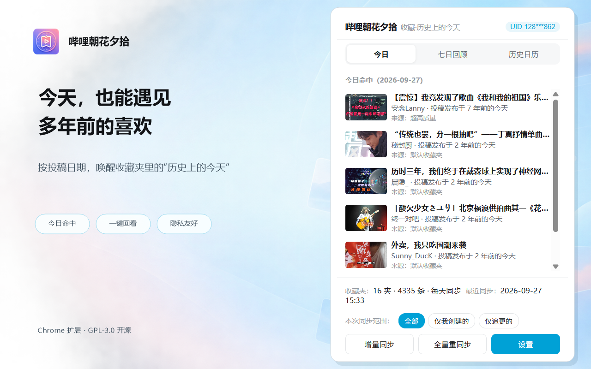
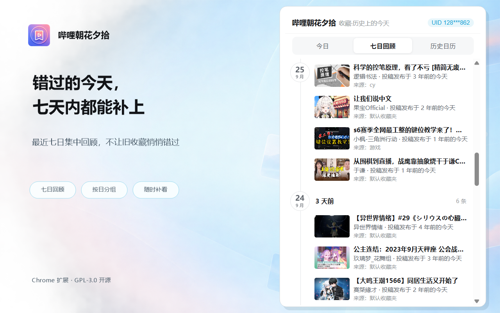
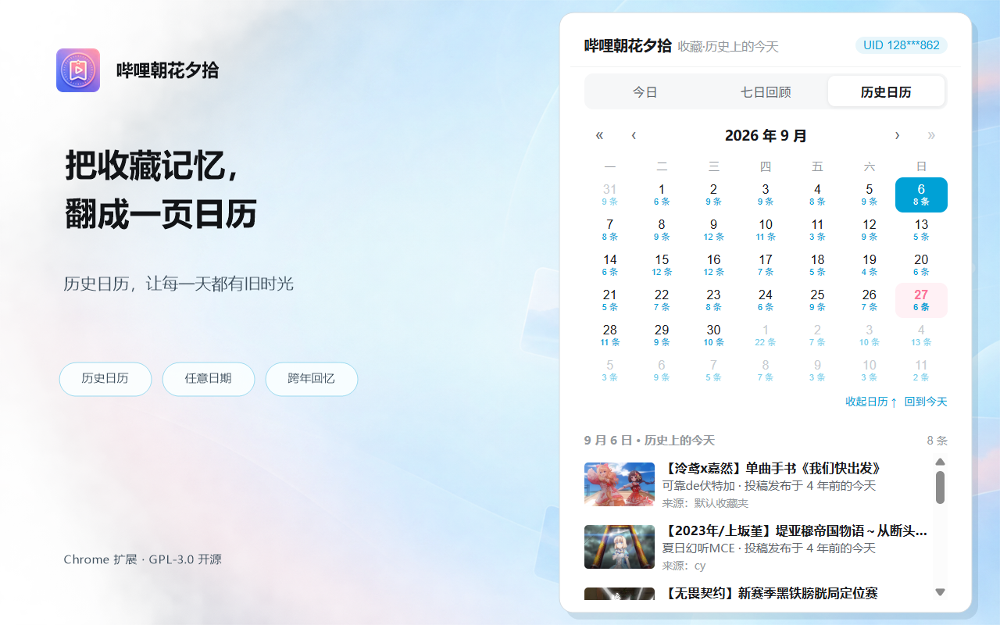

<p align="center">
  
</p>

<h1 align="center">哔哩朝花夕拾</h1>

> Chrome 扩展（Manifest V3）· 打开哔哩哔哩首页时，提醒你收藏夹中有哪些投稿发布于 X 年前的今天。

> 🛒 **一键安装**：[Chrome 应用商店 · 哔哩朝花夕拾](https://chromewebstore.google.com/detail/kgamlldkccpldahaohnbnnfdnegphppe)

> 当前正式版：**v1.1.0**

> Chrome 应用商店的更新需要审核，商店版本可能比 [GitHub Releases](https://github.com/Skwater/bilibili-fav-anniversary-reminder/releases) 晚几天，个别情况可能更久；实际可安装版本以商店页面显示为准。

打开 `https://www.bilibili.com/` 时，插件按你收藏夹内**视频投稿的发布时间**匹配今天的月日；命中时提醒你“投稿发布于 X 年前的今天”，点击即可回到视频。







> 非哔哩哔哩官方产品，与 B 站无任何关联；请遵守 B 站用户协议合理使用。
> 本项目由 **DeepSeek（AI）与 OpenAI Codex 参与设计、实现与维护**，仅供学习交流参考。

---

## 功能特性

- 📅 **历史上的今天**：打开 B 站首页时，浮层提示“投稿发布于 X 年前的今天”的历史投稿
- 🕐 **七日回顾**：集中查看最近七天错过的历史投稿，并按日期分组补看
- 🗓️ **历史日历**：在扩展 Popup 按年月浏览有历史投稿的日期，点击某天查看完整投稿列表；可将月历折叠为选中日期所在的一周，腾出更多明细空间
- ⏱️ **稍后再看**：在投稿封面右上角使用 B 站官方接口添加或移出稍后再看；时钟与对勾图标分别表示两种状态
- 📚 **收藏夹管理**：读取“我创建的 + 我收藏(追更)的”全部收藏夹，按来源分组、可折叠、可勾选
- 🧭 **首次向导**：第一次使用先选择要同步的收藏夹（区分自建/追更）再开始
- 🔄 **灵活同步**：支持手动、每次打开首页、每天一次，以及每 1～365 天自定义周期；换号时清理旧账号收藏缓存并保留设置
- ⚡ **智能增量**：差异检测 + 针对性同步——数目增加→增量补新、数目减少→全量清理；B 站已删除的收藏夹会在完整列表刷新后清除本地关联，共享视频仍保留在其他收藏夹中
- 🛡️ **风控克制**：视频分页保留基础间隔，接口响应变慢时延长等待；命中 412 后按设定时长冷却并接续
- 🧪 **模拟首页日期**：在高级设置中测试指定日期的首页提醒效果，与历史日历浏览互不影响
- 🔒 **隐私友好**：数据全部本地存储，不上传第三方

> 同步节流与风控处理的设计参考了 [BiliShelf](https://github.com/TLRKFXE/BiliShelf)，本项目根据自身同步流程独立实现。

## 安装

**方式一：Chrome 应用商店（推荐）**

前往 [哔哩朝花夕拾 · Chrome 应用商店](https://chromewebstore.google.com/detail/kgamlldkccpldahaohnbnnfdnegphppe) 点「添加至 Chrome」，之后会自动更新。

**方式二：本地开发加载**

1. Chrome/Edge 打开 `chrome://extensions`，右上开启「开发者模式」；
2. 点「加载已解压的扩展程序」，选择本目录的 `extension/` 文件夹；
3. 点击扩展图标，按插件弹窗引导打开哔哩哔哩、选择收藏夹并开始首次同步。

首次同步的选择和进度都显示在插件弹窗中；完成后切换到日常界面。首页右下角只在有每日命中时提醒。首次使用可能需要较多时间。

> 说明：登录态来自你浏览器内已登录的 B 站会话；扩展自身不持有、不存储任何凭据。

## 使用速览

- **首次**：插件弹窗引导进入 B 站 → 在同一弹窗中读取登录状态、进入首次同步 → 按“我创建的 / 追更的”分组勾选收藏夹 → 开始全量同步
- **日常**：扩展图标 Popup 点「增量同步」即可（几乎零请求的差异检测）
- **回顾**：Popup 可切换到「七日回顾」补看最近七天，或进入「历史日历」按年月查看任意日期的历史投稿
- **稍后再看**：鼠标悬浮封面后，点击右上角的时钟图标添加；已加入时显示对勾，再次点击即可移出；没有可用的 B 站标签时会自动打开首页并继续操作
- **范围**：增量/全量按钮旁可选 全部 / 仅我创建的 / 仅追更的
- **高级设置**（设置页最底部折叠区）：412 冷却、模拟首页日期、清空数据
- **调试**：设置页「高级设置 → 模拟首页日期」设定测试日期；有当日命中内容时，可用「重新显示当日提醒」再次查看首页提醒

## 同步与风控

同步视频时，扩展逐页请求，页与页之间留有间隔；接口响应变慢时会延长下一页的等待。

如果 B 站返回 412，扩展会按「高级设置」中的时长冷却（默认 15 分钟），到点后在有 B 站页面可用时继续未完成的同步；若已关闭页面，重新打开 B 站后再接续。请求因网络或页面状态中断时，已完成的进度会保留，可稍后重试；重新打开 B 站时，未完成的会话也可能自动接续。主动终止同步会清除本次断点。

## 目录结构

```
extension/          # 扩展本体（manifest / common / background / content / popup / options / icons）
tools/              # 公共工具自检 selftest.js；同步状态机自检 background-selftest.js
assets/             # 图标、三张宣传截图，以及 440×280 / 1400×560 Chrome 商店宣传图块
```

## 开发与自检

```bash
# 语法自检
node --check extension/*.js
# 单元自检（日期工具等）
node tools/selftest.js
# 同步状态机自检（分页失败、断点恢复、等量替换、登录并发等）
node tools/background-selftest.js
```

## 免责声明与隐私

- 非官方作品，仅供学习与个人使用；本项目不收集任何数据，不包含任何统计/上报代码；
- 你对本项目的使用与由此产生的影响（含 B 站账号风控、条款等）自行负责；
- 若你修改并公开分发，请保留本声明与下方许可证说明。

## 许可证

[GPL-3.0](LICENSE)

Copyright (c) 2026 哔哩朝花夕拾 contributors
